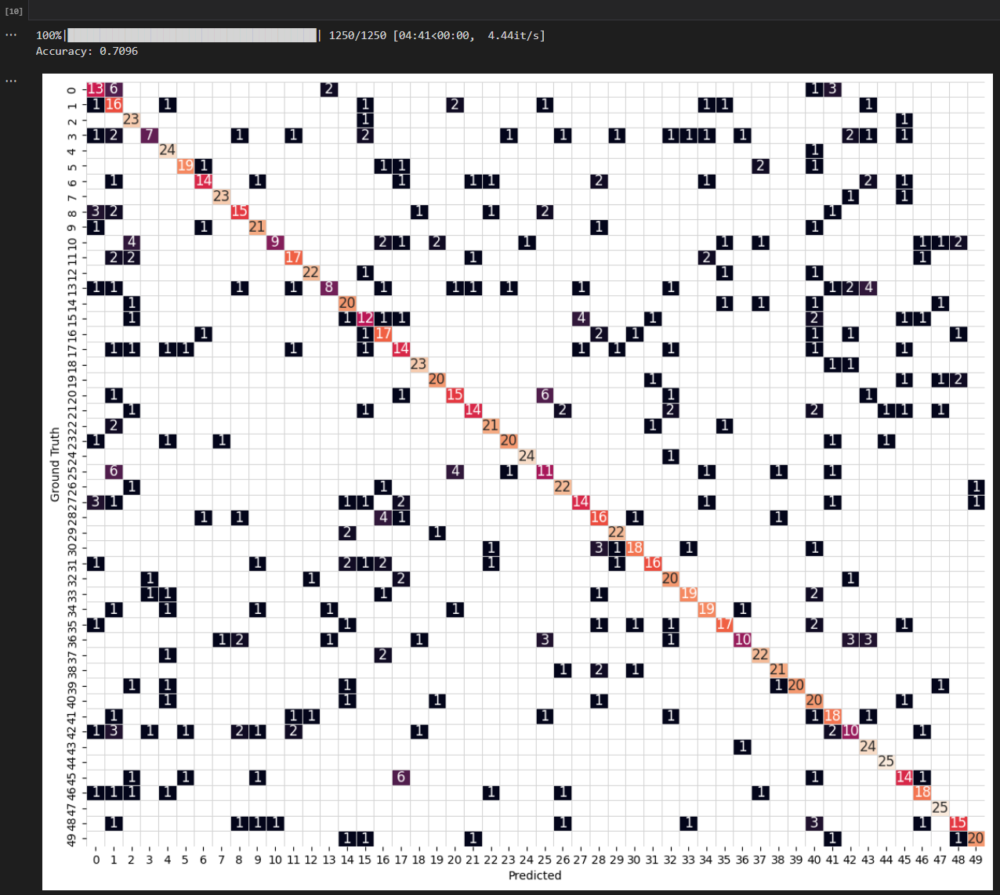
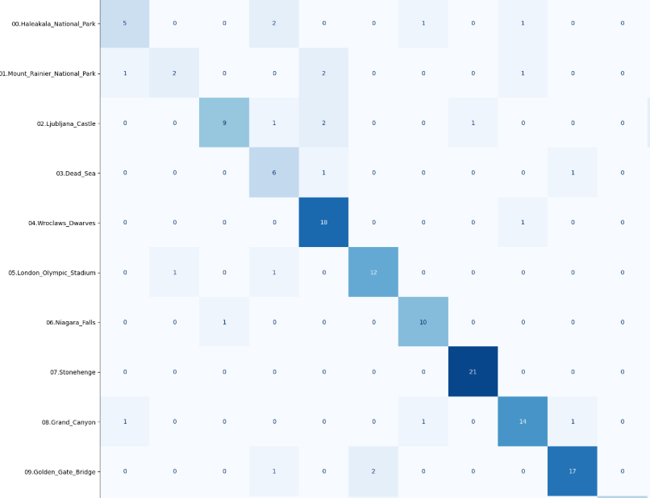
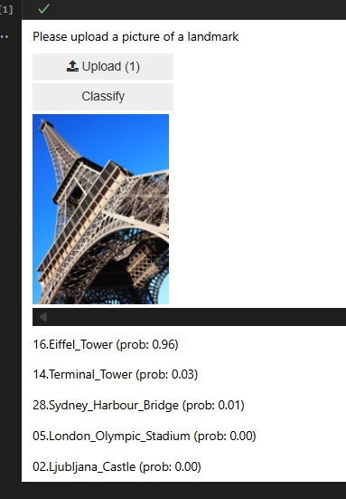
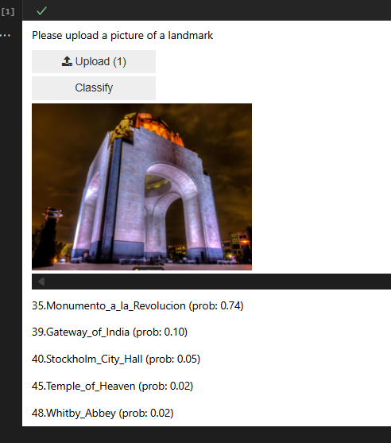

# Landmark Classification with Convolutional Neural Networks

## Project Overview

This project implements an end-to-end deep learning pipeline for landmark image classification using Convolutional Neural Networks (CNNs). The goal is to automatically predict the landmark depicted in an image when location metadata is not available.

Photo sharing and photo storage platforms often rely on location metadata to organize images, suggest tags, or improve search functionality. However, many images do not contain GPS or location metadata. In those cases, a computer vision model can help infer the location by recognizing visible landmarks in the image.

The project includes three main parts:

1. Building and training a CNN from scratch.
2. Using transfer learning with a pre-trained ResNet18 model.
3. Exporting the best model with TorchScript and using it in a simple prediction app.

The final solution compares a custom CNN architecture against a transfer learning approach and uses the best-performing model for inference.


---

## Project Screenshots

### TorchScript Model Export


The following screenshots provide visual model using TorchScript. The exported model can be loaded later for inference in the application.The following screenshots provide visual evidence of the completed landmark classification workflow, including model export, evaluation results, and application predictions.



---

### Matrix of the model

This screenshot shows the confusion matrix generated after evaluating the trained model on the test dataset. A stronger diagonal indicates that the model correctly classified many landmark images.



---

### Landmark Classification App Prediction 1

This screenshot shows the application running inference on a new landmark image and displaying the predicted landmark class probabilities.



---

### Landmark Classification App Prediction 2

This screenshot shows another example of the landmark classification application predicting the class of an unseen image.




---

## Project Objectives

The main objectives of this project are:

- Preprocess and augment landmark image data.
- Build a CNN architecture from scratch for multiclass classification.
- Train, validate, and test the custom CNN model.
- Apply transfer learning using a pre-trained CNN backbone.
- Compare the performance of both approaches.
- Export the trained model using TorchScript.
- Build a simple application that predicts landmark classes from new images.

---

## Dataset

The dataset contains images of landmarks organized into multiple classes. Each class represents a different landmark category.

The data is split into:

- Training set
- Validation set
- Test set

The model learns from the training data, hyperparameters are tuned using the validation data, and the final model performance is evaluated on the test data.

---

---

## Project Structure

```text
.
├── Project_Landmarks_Part1_CNNfromScratch__starter.ipynb
├── Project_Landmarks_Part2_TransferLearning__starter.ipynb
├── Project_Landmarks_Part3_App__starter.ipynb
├── src
│   ├── __init__.py
│   ├── data.py
│   ├── helpers.py
│   ├── model.py
│   ├── optimization.py
│   ├── predictor.py
│   ├── train.py
│   └── transfer.py
├── screenshots
│   ├── Export_using_torchscript.png
│   ├── Matrix_of_the_model.png
│   ├── Landmark_Classification1.png
│   └── Landmark_Classification2.png
├── static_images
├── requirements.txt
└── README.md
```


## Main Files

### Notebooks

#### `Project_Landmarks_Part1_CNNfromScratch__starter.ipynb`

This notebook contains the complete workflow for training a CNN from scratch. It includes:

- Data loading
- Image preprocessing
- Data augmentation
- CNN architecture definition
- Training and validation
- Testing
- TorchScript export

#### `Project_Landmarks_Part2_TransferLearning__starter.ipynb`

This notebook implements transfer learning using a pre-trained ResNet18 model. It includes:

- Loading a pre-trained CNN backbone
- Freezing the feature extractor
- Replacing the final classification layer
- Training the new classifier
- Testing the transfer learning model
- Exporting the model using TorchScript

#### `Project_Landmarks_Part3_App__starter.ipynb`

This notebook loads the exported TorchScript model and uses it to make predictions on new landmark images that are not part of the training or test datasets.

---

## Source Code Modules

### `src/data.py`

Contains the data loading and preprocessing pipeline.

The `get_data_loaders` function creates data loaders for training, validation, and testing. The image transformations include:

- Resize
- Random crop for training
- Center crop for validation and testing
- Data augmentation for training
- Conversion to tensor
- Normalization using dataset mean and standard deviation

### `src/model.py`

Defines the custom CNN architecture used in Part 1 of the project.

The model includes convolutional layers, activation functions, pooling layers, dropout, and fully connected layers. The final output layer produces predictions for the required number of landmark classes.

### `src/optimization.py`

Defines the loss function and optimizer configuration.

The project uses:

- CrossEntropyLoss for multiclass classification
- Adam or SGD optimizers
- Weight decay for regularization

### `src/train.py`

Contains the training, validation, optimization, and testing loops.

The training pipeline includes:

- Forward pass
- Loss calculation
- Backpropagation
- Optimizer update
- Validation loss monitoring
- Learning rate scheduling
- Checkpoint saving
- Test accuracy calculation

### `src/transfer.py`

Defines the transfer learning model.

A pre-trained ResNet18 model is used as the backbone. Its parameters are frozen, and the final fully connected layer is replaced with a new linear layer that outputs the required number of landmark classes.

### `src/predictor.py`

Defines the prediction wrapper used for TorchScript export.

The predictor applies the required image transformations, runs inference using the trained model, applies softmax to obtain probabilities, and returns the final prediction scores.

### `src/helpers.py`

Contains helper functions used across the project, including environment setup, dataset statistics calculation, and visualization utilities.

---

## Data Preprocessing

Image preprocessing is an important part of this project because CNN models require input images to have a consistent size and numerical format.

The preprocessing pipeline includes:

1. Resizing images to a fixed size.
2. Cropping images to match the input size expected by the model.
3. Applying data augmentation to the training set.
4. Converting images into PyTorch tensors.
5. Normalizing images using the dataset mean and standard deviation.

For the training set, data augmentation is used to improve generalization. This helps the model become more robust to variations in image position, orientation, and appearance.

---

## CNN from Scratch

The first model is a custom CNN built from scratch. This model learns all image features directly from the landmark dataset.

The architecture includes:

- Convolutional layers for feature extraction
- ReLU activation functions for non-linearity
- Pooling layers for spatial downsampling
- Dropout for regularization
- Fully connected layers for classification

This approach demonstrates the full CNN training process and provides a baseline performance for comparison with transfer learning.

---

## Transfer Learning Approach

The second model uses transfer learning with a pre-trained ResNet18 architecture.

ResNet18 is suitable for landmark classification because it is a deep convolutional neural network designed for image classification tasks. It can learn hierarchical visual features such as edges, textures, shapes, and object-level patterns.

In this project:

1. A pre-trained ResNet18 model is loaded.
2. The parameters of the pre-trained backbone are frozen.
3. The original final classification layer is replaced.
4. A new linear layer is added with 50 output classes.
5. Only the new classifier layer is trained.

This approach is effective because the pre-trained network has already learned useful visual representations from a large image dataset. These representations are transferable to landmark classification, where images contain distinctive architectural structures, textures, and visual patterns.

Transfer learning usually provides better performance, faster convergence, and more stable training than training a deep CNN from scratch.

---

## Model Architecture Explanation

For the transfer learning model, I used a pre-trained ResNet18 architecture as the backbone and replaced its final fully connected layer with a new linear layer that outputs the required number of landmark classes.

The first step was to choose a pre-trained convolutional neural network. I selected ResNet18 because it is a well-known CNN architecture that performs well on image classification tasks while still being relatively lightweight compared with deeper models. This makes it suitable for this project because it can extract strong visual features without requiring excessive training time or computational resources.

The second step was to load the ResNet18 model with pre-trained weights. Using a pre-trained model is useful because the network has already learned general image features from a large image dataset. The early layers can detect simple patterns such as edges, corners, colors, and textures, while deeper layers can detect more complex shapes and object-level patterns. These features are useful for landmark classification because landmarks often contain distinctive architectural structures, visual patterns, textures, and shapes.

The third step was to freeze the parameters of the pre-trained backbone. By freezing the convolutional layers, the model keeps the useful visual representations learned during pre-training and only trains the new classifier layer. This reduces the number of trainable parameters, speeds up training, and helps reduce the risk of overfitting, especially because the landmark dataset is smaller than the dataset originally used to train ResNet18.

The fourth step was to replace the original final classification layer with a new linear layer. The input size of this layer matches the number of features produced by the ResNet18 backbone, and the output size is equal to the number of landmark classes in this project, which is 50. This allows the model to adapt the general visual features learned by ResNet18 to the specific landmark classification task.

This architecture is suitable for the current problem because landmark classification is an image classification task, and ResNet18 is designed to learn hierarchical visual features from images. Using transfer learning allows the model to achieve better performance and faster convergence than training a CNN from scratch. The frozen ResNet18 backbone acts as a strong feature extractor, while the new final layer learns to classify those features into the correct landmark categories.

---

## Training Configuration

The transfer learning model was trained using the following configuration:

```python
batch_size = 32
valid_size = 0.2
num_epochs = 10
num_classes = 50
learning_rate = 0.001
optimizer = "adam"
weight_decay = 0.0001
```

The Adam optimizer was selected because it usually provides stable and efficient optimization for deep learning models. Weight decay was used as a regularization technique to reduce overfitting.

---

## Testing

After training, the model is evaluated on the test dataset using the saved best weights.

The testing process calculates:

- Test loss
- Test accuracy
- Predicted labels
- True labels
- Confusion matrix

The transfer learning model is expected to achieve at least 60% test accuracy according to the project requirements.

---

## TorchScript Export

The trained models are exported using TorchScript so they can be used outside the notebook environment.

The exported models include:

```text
checkpoints/original_exported.pt
checkpoints/transfer_exported.pt
```

The transfer learning model is wrapped inside the `Predictor` class before export. This ensures that preprocessing, inference, and softmax probability calculation are included in the final serialized model.

The exported model can be loaded using:

```python
model_reloaded = torch.jit.load("checkpoints/transfer_exported.pt")
```

---

## Application

The final part of the project demonstrates how to use the exported TorchScript model in a simple application.

The app:

1. Loads the trained TorchScript model.
2. Processes a new landmark image.
3. Runs inference.
4. Displays the image.
5. Shows the predicted landmark class probabilities.

The test image used in the app is not part of the training or test dataset, which demonstrates how the model performs on unseen data.

---

## How to Run the Project

### 1. Install Dependencies

```bash
pip install -r requirements.txt
```

### 2. Run the CNN from Scratch Notebook

```text
Project_Landmarks_Part1_CNNfromScratch__starter.ipynb
```

### 3. Run the Transfer Learning Notebook

```text
Project_Landmarks_Part2_TransferLearning__starter.ipynb
```

### 4. Run the App Notebook

```text
Project_Landmarks_Part3_App__starter.ipynb
```

---

## Running Tests

The project includes tests for several source files.

Run the tests with:

```bash
pytest -vv src/data.py
pytest -vv src/model.py
pytest -vv src/optimization.py
pytest -vv src/train.py
pytest -vv src/transfer.py
pytest -vv src/predictor.py
```

All required tests should pass before submitting the project.

---

## Results Summary

The project compares two approaches:

| Model | Description | Expected Outcome |
|---|---|---|
| CNN from Scratch | Custom CNN trained only on the landmark dataset | Baseline landmark classifier |
| Transfer Learning | Pre-trained ResNet18 with a new classifier layer | Higher accuracy and faster convergence |

The transfer learning model is expected to outperform the CNN trained from scratch because it uses visual features learned from a much larger image dataset.

---

## Key Learnings

This project demonstrates several important deep learning concepts:

- Image preprocessing and normalization
- Data augmentation
- CNN architecture design
- Training and validation loops
- Loss functions and optimizers
- Regularization with dropout and weight decay
- Transfer learning
- Model evaluation
- TorchScript model export
- Building a simple image classification app

---

## Potential Use Cases

A landmark classification model can be useful in several real-world scenarios:

- Automatic photo organization
- Location-based image tagging
- Travel photo recommendation systems
- Digital asset management
- Tourism applications
- Image search engines
- Historical or cultural landmark identification
- Smart photo album generation

---

## Technologies Used

- Python
- PyTorch
- TorchVision
- NumPy
- Matplotlib
- Jupyter Notebook
- TorchScript
- Pytest

---

## Final Notes

This project follows an end-to-end machine learning workflow, from data preprocessing and model training to evaluation and deployment. The transfer learning model using ResNet18 provides a strong solution for landmark classification because it combines a pre-trained visual feature extractor with a task-specific classifier for the landmark dataset.
